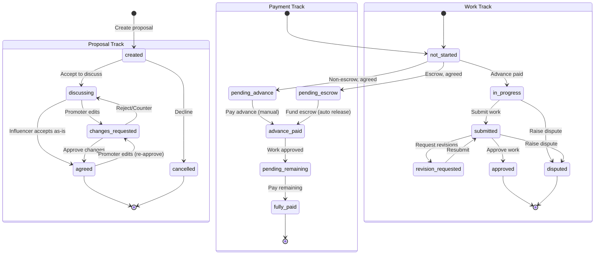

# Proposal Flow Documentation

This document defines the complete proposal workflow for the influencer marketplace platform.

---

## Overview

The proposal workflow manages the lifecycle of a collaboration from initial proposal to completion. Instead of a single linear status, **we use 3 parallel status tracks** that are always visible independently:

1. **Proposal Status** - Tracks proposal negotiation and agreement
2. **Payment Status** - Tracks payment milestones (advance and remaining)
3. **Work Status** - Tracks work progress and review

This approach allows clear visibility into each aspect of the collaboration independently.

---

## Status Model: 3 Parallel Tracks

### Track 1: Proposal Status

| Status | Description | Who Acts Next |
|--------|-------------|---------------|
| `created` | Proposal created and sent to influencer | Influencer |
| `discussing` | Under discussion/negotiation | Both |
| `changes_requested` | Proposal edited by promoter, awaiting re-approval | Influencer |
| `agreed` | Both parties agreed on terms | - |
| `cancelled` | Proposal cancelled | - |

**Transitions:**
- `created` → `discussing` (influencer accepts to discuss)
- `created` → `cancelled` (influencer declines)
- `discussing` → `changes_requested` (promoter edits proposal)
- `discussing` → `agreed` (influencer accepts proposal as-is)
- `changes_requested` → `agreed` (influencer approves changes)
- `changes_requested` → `discussing` (influencer rejects/counter, or raises dispute)
- `agreed` → `changes_requested` (promoter edits proposal AFTER influencer already agreed)

**Important Behaviors:**
- **Influencer acceptance:** Influencer always accepts the entire proposal as provided by the promoter
- **Influencer suggestions:** Influencer can "suggest changes" via chat, which promoter can optionally apply
- **Promoter edits at any time:** If promoter edits the proposal AFTER influencer has already agreed, it automatically goes to `changes_requested` and influencer must re-approve
- **Re-approval loop:** Influencer can approve changes (→ `agreed`) or reject (→ `discussing` to continue negotiation, or raise dispute)

### Track 2: Payment Status

| Status | Description | Who Acts Next |
|--------|-------------|---------------|
| `not_started` | No payment initiated yet | Promoter |
| `pending_advance` | Waiting for advance payment (non-escrow) | Promoter |
| `pending_escrow` | Waiting for full escrow funding (escrow mode) | Promoter |
| `advance_paid` | Advance payment completed/released | Promoter |
| `pending_milestone` | Waiting for milestone payment (optional) | Promoter |
| `milestone_paid` | Milestone payment completed (optional) | Promoter |
| `pending_remaining` | Waiting for remaining payment | Promoter |
| `fully_paid` | All payments completed | - |

**Transitions:**

#### Non-Escrow Flow (`paymentMode: 'none'` or `'platform'`)
- `not_started` → `pending_advance` (proposal agreed, influencer paid platform fee)
- `pending_advance` → `advance_paid` (promoter pays advance manually + uploads transaction details)
- `advance_paid` → `pending_milestone` (optional: if milestone payments configured)
- `pending_milestone` → `milestone_paid` (promoter pays milestone)
- `milestone_paid` → `pending_milestone` (more milestones) OR `pending_remaining` (all milestones done)
- `advance_paid` → `pending_remaining` (if no milestones, work approved)
- `pending_remaining` → `fully_paid` (promoter pays remaining manually + uploads details)

#### Escrow Flow (`paymentMode: 'escrow'`)
- `not_started` → `pending_escrow` (proposal agreed, influencer paid platform fee)
- `pending_escrow` → `advance_paid` (promoter funds full escrow → system automatically releases advance immediately)
- `advance_paid` → `pending_milestone` (optional: if milestone payments configured)
- `pending_milestone` → `milestone_paid` (system releases milestone from escrow)
- `milestone_paid` → `pending_milestone` (more milestones) OR `pending_remaining` (all milestones done)
- `advance_paid` → `pending_remaining` (if no milestones, work approved)
- `pending_remaining` → `fully_paid` (system automatically releases remaining from escrow)

**Payment Mode Rules:**
- `paymentMode` can only be changed when Payment Status is `not_started`, `pending_advance`, or `pending_escrow`
- Once payment is initiated (advance paid or escrow funded), `paymentMode` is locked
- For non-escrow payments, promoter manually marks as paid and uploads proof (screenshot, transaction ID, etc.)

### Track 3: Work Status

| Status | Description | Who Acts Next |
|--------|-------------|---------------|
| `not_started` | Work not yet started | Influencer |
| `in_progress` | Actively working on deliverables | Influencer |
| `revision_requested` | Promoter requested revisions (stay in review) | Influencer |
| `submitted` | Work submitted, awaiting promoter review | Promoter |
| `approved` | Work approved by promoter | - |
| `disputed` | Dispute raised, admin intervention | Admin |

**Transitions:**
- `not_started` → `in_progress` (advance paid, influencer starts work)
- `in_progress` → `submitted` (influencer submits work at 100%)
- `submitted` → `revision_requested` (promoter requests changes)
- `revision_requested` → `submitted` (influencer resubmits)
- `submitted` → `approved` (promoter approves work)

---

## Overall Proposal State

The overall proposal state is derived from combining all 3 tracks:

| Overall State | Proposal Status | Payment Status | Work Status |
|---------------|-----------------|----------------|-------------|
| `pending` | `created` | `not_started` | `not_started` |
| `discussing` | `discussing` OR `changes_requested` | `not_started` | `not_started` |
| `awaiting_payment` | `agreed` | `pending_advance` OR `pending_escrow` | `not_started` |
| `in_progress` | `agreed` | `advance_paid` OR `milestone_paid` | `in_progress` |
| `in_review` | `agreed` | `advance_paid` OR `milestone_paid` | `submitted` OR `revision_requested` |
| `completed` | `agreed` | `fully_paid` | `approved` |
| `cancelled` | `cancelled` | Any | Any |
| `disputed` | Any | Any | `disputed` |

**Completion Condition:**
A proposal is marked as **`completed`** only when ALL 3 tracks reach their final state:
- Proposal Status: `agreed`
- Payment Status: `fully_paid`
- Work Status: `approved`

---

## Workflow Diagram



---

## Detailed Workflow Steps

### Phase 1: Proposal Negotiation

**Step 1: Promoter creates and sends proposal**
- Creates proposal with title, description, requirements, deliverables
- **Proposal Status:** `created`
- **Payment Status:** `not_started`
- **Work Status:** `not_started`

**Step 2: Influencer receives proposal**
- Options:
  - **Decline** → Proposal Status: `cancelled`
  - **Accept to discuss** → Proposal Status: `discussing`

**Step 3: Discussion and Negotiation**
- Both parties negotiate in chat
- **Influencer suggestions:** Influencer can "suggest changes" via chat, promoter may apply them
- **Promoter edits:** When promoter edits proposal:
  - Proposal Status: `discussing` → `changes_requested`
  - Influencer notified of changes
  - Influencer must approve → `agreed` or reject → `discussing`
- **Influencer accepts proposal as-is:** Proposal Status: `discussing` → `agreed`

**Step 4: Post-Agreement Edits (if any)**
- If promoter edits proposal AFTER influencer already agreed:
  - Proposal Status: `agreed` → `changes_requested`
  - Influencer must re-approve (can loop multiple times)

### Phase 2: Payment

**Trigger:** Proposal Status = `agreed`

**Step 1: Influencer pays platform fee**
- Influencer pays ₹49 + GST
- Payment Status moves from `not_started`

**Step 2: Promoter selects payment mode and pays**

#### Option A: Record-Only (`paymentMode: 'none'`)
- No advance required
- **Payment Status:** `not_started` → `fully_paid` (promoter marks as complete, uploads proof if needed)
- Work can start immediately
- All payment happens offline

#### Option B: Platform Payment with Advance (`paymentMode: 'platform'`)
- **Payment Status:** `not_started` → `pending_advance` → `advance_paid`
- Promoter pays advance amount manually
- Promoter uploads transaction details (screenshot, UPI ref, etc.)
- Influencer can start work after advance confirmed

#### Option C: Escrow (`paymentMode: 'escrow'`)
- **Payment Status:** `not_started` → `pending_escrow` → `advance_paid`
- Promoter pays full amount + escrow fee + GST to escrow
- System automatically releases advance immediately
- Remaining amount held in escrow until work approved

**Payment Mode Lock:**
- `paymentMode` can only be changed when Payment Status is `not_started`, `pending_advance`, or `pending_escrow`
- Once payment reaches `advance_paid`, payment mode is locked

### Phase 3: Work Execution

**Trigger:** Payment Status = `advance_paid` OR `fully_paid` (record-only)

**Step 1: Influencer starts work**
- **Work Status:** `not_started` → `in_progress`
- Influencer updates progress percentage (0-100%)
- Uploads drafts/proofs

**Step 2: Influencer submits work**
- At 100% completion, submit for review
- **Work Status:** `in_progress` → `submitted`

**Step 3: Promoter reviews work**
- Promoter reviews submitted work
- Options:
  - **Approve** → Work Status: `approved`
  - **Request revisions** → Work Status: `revision_requested`

**Step 4: Revisions (if needed)**
- Influencer makes requested changes
- Resubmits work
- **Work Status:** `revision_requested` → `submitted`
- Loop continues until approved

### Phase 4: Final Payment

**Trigger:** Work Status = `approved`

**Step 1: Promoter pays remaining amount**

#### For Non-Escrow (`paymentMode: 'none'` or `'platform'`)
- Promoter pays remaining balance manually
- Uploads transaction details (screenshot, UPI ref, etc.)
- **Payment Status:** `advance_paid` → `pending_remaining` → `fully_paid`

#### For Escrow (`paymentMode: 'escrow'`)
- System automatically releases remaining amount from escrow
- **Payment Status:** `advance_paid` → `fully_paid` (automatic, no manual step)

**Step 2: Completion**
- All 3 tracks reach final state:
  - Proposal Status: `agreed`
  - Payment Status: `fully_paid`
  - Work Status: `approved`
- Overall proposal state becomes `completed`
- Generate invoices/documents
- Both parties can leave reviews

---

## Change Request Workflow

### Proposal Changes

**When:** Any time during discussion or after agreement

**Who:** Primarily Promoter, Influencer can only suggest via chat

**Process:**

#### During Discussion (`proposalStatus: discussing`)
1. Promoter edits proposal (amount, deliverables, requirements, etc.)
2. **Proposal Status:** `discussing` → `changes_requested`
3. Influencer notified via notification + chat
4. Influencer reviews changes:
   - **Approve** → Proposal Status: `agreed`
   - **Reject/Counter** → Proposal Status: `discussing` (continue negotiating)

#### After Agreement (`proposalStatus: agreed`)
1. Promoter edits proposal (even though influencer already agreed)
2. **Proposal Status:** `agreed` → `changes_requested`
3. Influencer notified that promoter made changes to agreed proposal
4. Influencer must re-approve:
   - **Approve** → Proposal Status: `agreed`
   - **Reject** → Proposal Status: `discussing` (renegotiate)
   - **Dispute** → Work Status: `disputed` (if unreasonable changes)

### Work Revision Requests (During Review)

**When:** Work Status = `submitted`

**Who:** Promoter

**Process:**
1. Promoter requests revisions with specific feedback
2. **Work Status:** `submitted` → `revision_requested`
3. Influencer makes changes and resubmits
4. **Work Status:** `revision_requested` → `submitted`
5. Promoter reviews again (can loop multiple times)

---

## Dispute Handling

### When Can Disputes Be Raised?

Disputes can be raised during:
- **Work in progress:** Disagreement on deliverables, timeline, etc.
- **Work review:** Disagreement on quality, completion, etc.

### Dispute Process

1. Either party raises dispute via support/admin
2. **Work Status:** → `disputed`
3. Admin intervenes and reviews case
4. Admin resolution:
   - **Resume** → Return to previous work status
   - **Cancel** → Proposal Status → `cancelled`
   - **Force complete** → All tracks → final states

---

## Permission Matrix

| Action | Promoter | Influencer | Admin |
|--------|----------|------------|-------|
| Create proposal | ✅ | ❌ | ✅ |
| Edit proposal (discussing) | ✅ own | ❌ | ✅ |
| Edit proposal (agreed) | ✅* | ❌ | ✅ |
| Accept/Decline proposal | ❌ | ✅ | ✅ |
| Agree to terms | ✅ | ✅ | ✅ |
| Pay advance | ✅ own | ❌ | ✅ |
| Pay remaining | ✅ own | ❌ | ✅ |
| Fund escrow | ✅ own | ❌ | ✅ |
| Start work | ❌ | ✅ | ✅ |
| Submit work | ❌ | ✅ | ✅ |
| Request revisions | ✅ own | ❌ | ✅ |
| Approve work | ✅ own | ❌ | ✅ |
| Raise dispute | ✅ | ✅ | ✅ |
| Cancel proposal | ✅ own | ✅ own | ✅ |
| Resolve dispute | ❌ | ❌ | ✅ |

*Only via "Request Changes" which sets proposal status to `changes_requested`

---

## Audit Trail

All state transitions and content changes are logged to `proposalHistory` collection.

### Change Types Logged

| Change Type | Description | Track |
|-------------|-------------|-------|
| `proposal_created` | Initial proposal creation | Proposal |
| `proposal_status_changed` | Any proposal status transition | Proposal |
| `proposal_edited` | Content/amount edited | Proposal |
| `changes_requested` | Changes requested/approved/rejected | Proposal |
| `payment_status_changed` | Any payment status transition | Payment |
| `advance_paid` | Advance payment completed | Payment |
| `escrow_funded` | Escrow funded with full amount | Payment |
| `remaining_paid` | Remaining payment completed | Payment |
| `work_status_changed` | Any work status transition | Work |
| `work_started` | Work moved to in_progress | Work |
| `work_submitted` | Work submitted for review | Work |
| `revision_requested` | Revisions requested | Work |
| `work_approved` | Work approved | Work |
| `dispute_raised` | Dispute raised | Work |
| `dispute_resolved` | Dispute resolved by admin | Work |
| `proposal_cancelled` | Proposal cancelled | Proposal |
| `document_uploaded` | Attachment added | Any |
| `terms_accepted` | Influencer agreed to terms | Proposal |

### History Entry Structure

```typescript
interface ProposalHistoryEntry {
  id: string;
  proposalId: string;
  changedBy: string;        // userId
  changedByRole: 'influencer' | 'promoter' | 'system';
  timestamp: number;
  changeType: ChangeType;
  track: 'proposal' | 'payment' | 'work';
  previousStatus?: string;
  newStatus?: string;
  changedFields?: string[];
  previousValues?: Record<string, any>;
  newValues?: Record<string, any>;
  reason?: string;
  metadata?: Record<string, any>;
}
```

---

## UI: Three-Track Stepper

### Visual Layout

```
┌─────────────────────────────────────────────────────────────────────────────┐
│  Proposal: Instagram Reel for Brand XYZ                                     │
│  with @techinfluencer                                                        │
│                                                                              │
│  ┌─────────────────────────────────────────────────────────────────────┐   │
│  │  📋 PROPOSAL                                                         │   │
│  │  ●──●──●                                                            │   │
│  │  Sent  Discussing  Agreed                                            │   │
│  └─────────────────────────────────────────────────────────────────────┘   │
│                                                                              │
│  ┌─────────────────────────────────────────────────────────────────────┐   │
│  │  💰 PAYMENT                                                          │   │
│  │  ●──●──○──○                                                         │   │
│  │  Advance  Paid  Pending Remaining  Fully Paid                       │   │
│  └─────────────────────────────────────────────────────────────────────┘   │
│                                                                              │
│  ┌─────────────────────────────────────────────────────────────────────┐   │
│  │  🎯 WORK                                                             │   │
│  │  ●──●──○──○                                                         │   │
│  │  Started  In Progress  Submitted  Approved                          │   │
│  └─────────────────────────────────────────────────────────────────────┘   │
│                                                                              │
│  [Activity Log]                                                             │
└─────────────────────────────────────────────────────────────────────────────┘
```

Legend:
- ● = Completed
- ⚙️ = Active/In Progress
- ○ = Pending

### Track Stepper States

#### Proposal Track

| Status | Step | State |
|--------|------|-------|
| `created` | Created | ⚙️ Active |
| `discussing` | Discussing | ⚙️ Active |
| `changes_requested` | Changes Requested | ⚙️ Active (with indicator) |
| `agreed` | Agreed | ● Completed |
| `cancelled` | - | ❌ Cancelled |

#### Payment Track

| Status | Step | State |
|--------|------|-------|
| `not_started` | Pending | ⏳ Pending |
| `pending_advance` | Pending Advance | ⚙️ Active |
| `pending_escrow` | Pending Escrow | ⚙️ Active |
| `advance_paid` | Advance Paid | ● Completed |
| `pending_milestone` | Pending Milestone | ⚙️ Active (optional) |
| `milestone_paid` | Milestone Paid | ● Completed (optional) |
| `pending_remaining` | Pending Remaining | ⚙️ Active |
| `fully_paid` | Fully Paid | ● Completed |

#### Work Track

| Status | Step | State |
|--------|------|-------|
| `not_started` | Not Started | ⏳ Pending |
| `in_progress` | In Progress | ⚙️ Active |
| `revision_requested` | Revision Requested | ⚙️ Active (revisions) |
| `submitted` | Submitted | ⚙️ Active (review) |
| `approved` | Approved | ● Completed |
| `disputed` | - | ⚠️ Disputed |

---

## Data Model

### Proposal Interface

```typescript
interface Proposal {
  id: string;
  promoterId: string;
  influencerId: string;

  // Three parallel status tracks
  proposalStatus: ProposalStatus;
  paymentStatus: PaymentStatus;
  workStatus: WorkStatus;

  // Overall computed state (for filters, queries)
  overallStatus: OverallStatus;

  // Payment details (flexible for milestones)
  paymentMode: 'none' | 'platform' | 'escrow';
  finalAmount?: number; // Total agreed amount

  // Payment schedule - flexible array of milestones/payments
  paymentSchedule?: Array<{
    id: string;
    type: 'advance' | 'milestone' | 'remaining';
    name: string; // e.g., "Advance", "First Draft", "Final Delivery"
    amount: number;
    dueAfter?: number; // Percentage of work completion or null if upfront
    status: 'pending' | 'paid' | 'released';
    paidAt?: number;
    proof?: {
      transactionId?: string;
      screenshotUrl?: string;
      notes?: string;
    };
  }>;

  // Computed fields for convenience
  advanceAmount?: number; // Sum of all upfront payments (dueAfter: null or 0)
  remainingAmount?: number; // Sum of all milestone payments
  totalPaid?: number; // Sum of all paid payments

  // Platform fees
  fees?: {
    platformFeeInfluencer: number;
    platformFeePromoter?: number;
    escrowFee?: number;
    escrowFeeSplit?: { influencer: number; promoter: number };
    gstAmount?: number;
    paidBy: { influencer: boolean; promoter: boolean };
  };

  // Content
  title: string;
  description: string;
  requirements: string;
  deliverables: string[];
  attachments: ProposalAttachment[];
  deadline?: number;

  // Work tracking
  completionPercentage: number; // 0-100

  // Timestamps
  createdAt: number;
  updatedAt: number;
}

type ProposalStatus =
  | 'created'
  | 'discussing'
  | 'changes_requested'
  | 'agreed'
  | 'cancelled';

type PaymentStatus =
  | 'not_started'
  | 'pending_advance'
  | 'pending_escrow'
  | 'advance_paid'
  | 'pending_milestone' // Optional: if milestones between advance and remaining
  | 'milestone_paid'    // Optional: milestone payment completed
  | 'pending_remaining'
  | 'fully_paid';

type WorkStatus =
  | 'not_started'
  | 'in_progress'
  | 'revision_requested'
  | 'submitted'
  | 'approved'
  | 'disputed';

type OverallStatus =
  | 'pending'
  | 'discussing'
  | 'awaiting_payment'
  | 'in_progress'
  | 'in_review'
  | 'completed'
  | 'cancelled'
  | 'disputed';
```

---

## Migration from Current Model

### Current Single Status → Three Track Model

| Current Status | Proposal Status | Payment Status | Work Status |
|----------------|-----------------|----------------|-------------|
| `pending` | `created` | `not_started` | `not_started` |
| `discussing` | `discussing` | `not_started` | `not_started` |
| `finalized` + !influencerAcceptedTerms | `discussing` | `not_started` | `not_started` |
| `finalized` + influencerAcceptedTerms + !advancePaid | `agreed` | `pending_advance` OR `pending_escrow` | `not_started` |
| `finalized` + influencerAcceptedTerms + advancePaid | `agreed` | `advance_paid` | `not_started` |
| `in_progress` + !submittedWork | `agreed` | `advance_paid` | `in_progress` |
| `in_progress` + submittedWork | `agreed` | `advance_paid` | `submitted` |
| `completed` | `agreed` | `fully_paid` | `approved` |
| `cancelled` | `cancelled` | `not_started` | `not_started` |
| `disputed` | `agreed` | `advance_paid` | `disputed` |

---

## Open Questions

1. **Payment flow for escrow:** Should "Release Advance" happen automatically when escrow is funded, or require promoter confirmation?

2. **Platform fee refund:** If proposal cancels after influencer pays fee but before promoter pays, do we refund the influencer?

3. **Auto-archive timeout:** Implement 7-day timeout for inactive proposals (mentioned in payment-flow.md)?

4. **Revision limits:** Should there be a maximum number of revision cycles before dispute can be raised?

5. **Overall status field:** Keep `overallStatus` as computed field for backward compatibility, or migrate all queries to use 3 tracks?

---

## Document Version

- **Created:** 2025-01-05
- **Last Updated:** 2025-01-05
- **Version:** 2.0 (Three-Track Model)
- **Status:** Draft for review
